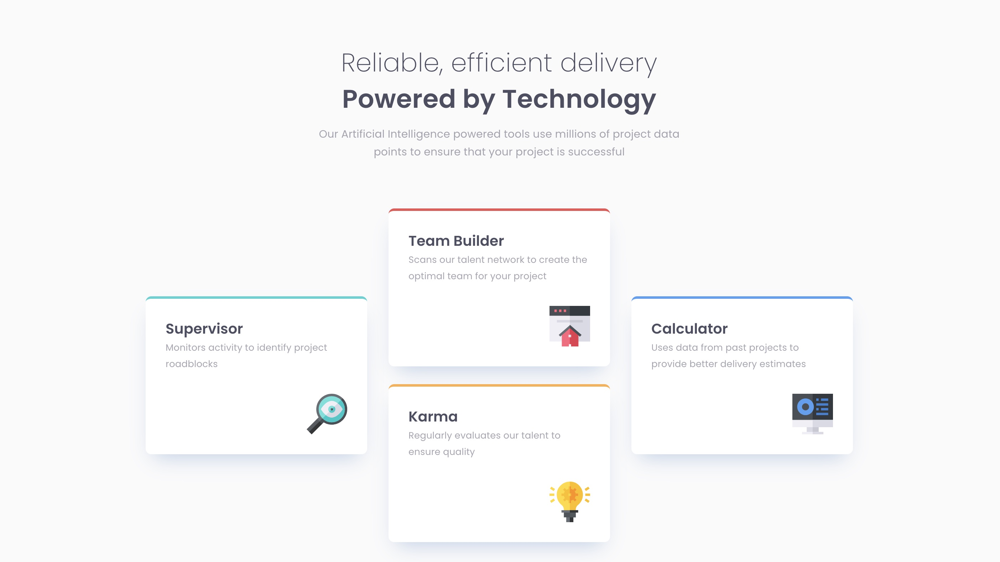

# Frontend Mentor - Four card feature section solution

This is a solution to the [Four card feature section challenge on Frontend Mentor](https://www.frontendmentor.io/challenges/four-card-feature-section-weK1eFYK). Frontend Mentor challenges help you improve your coding skills by building realistic projects. 

## Table of contents

- [Overview](#overview)
  - [The challenge](#the-challenge)
  - [Screenshot](#screenshot)
  - [Links](#links)
- [My process](#my-process)
  - [Built with](#built-with)
  - [What I learned](#what-i-learned)
  - [Continued development](#continued-development)
  - [Useful resources](#useful-resources)
- [Author](#author)

## Overview

### The challenge

Users should be able to:

- View the optimal layout for the site depending on their device's screen size

### Screenshot




### Links

- Solution URL: [Add solution URL here](https://your-solution-url.com)
- Live Site URL: [Add live site URL here](https://your-live-site-url.com)

## My process

### Built with

- Semantic HTML5 markup
- Flexbox
- Mobile-first workflow

### What I learned

I created responsive layouts using the `flex-direction` property to adjust the design for mobile and desktop views. For the mobile layout, I set three column-shaped `<div>` elements in a flex container with `flex-direction: column`, stacking them vertically for a user-friendly experience. Then, I added a media query for desktop, changing `flex-direction` to `row` so the columns aligned horizontally, maximizing screen space.

```html
<div class="cols">
  <div class="col-one"></div>
  <div class="col-two"></div>
  <div class="col-three"></div>
</div>
```

Mobile 
```css
.cols {
  display: flex;
  flex-direction: row;
}
```

Desktop
```css
@media screen and (min-width: 1120px){
  .cols {
    display: flex;
    flex-direction: row;
    gap: 30px;
  }
}
```

### Continued development

I achieved a grid-like layout by creatively using Flexbox. Next time, I’d like to explore using CSS Grid directly.

### Useful resources

- [CSS Tricks](https://css-tricks.com/snippets/css/a-guide-to-flexbox/#aa-background) - This helped me understand Flexbox.

## Author

- Frontend Mentor - [@hchao7](https://www.frontendmentor.io/profile/hchao7)
